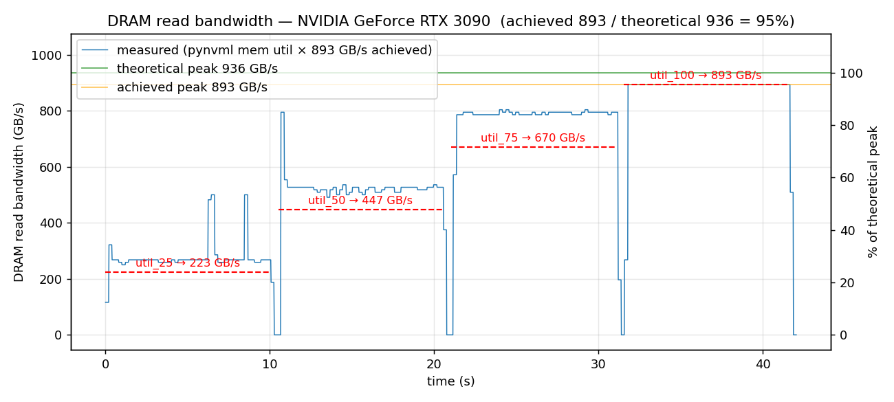

# DRAM Read Utilization 실험

GPU DRAM **read utilization** 을 **25% → 50% → 75% → 100%** 로 각각 10초씩
계단 형태로 강제 구동하고, 타임라인에서 검증하기 위한 자동화 도구 모음.

AccelWattch GPU 전력 모델 검증(특히 DRAM 전력 항) 에서 **원하는 BW utilization
수준을 제어한 microbenchmark** 가 필요해서 만들었음.

## 두 가지 구현 방식

| 구현 | 요구사항 | 검증 방법 | 특징 |
|---|---|---|---|
| **CuPy (Python)** | `pip` 만 (nvcc / CUDA toolkit 불필요) | `pynvml` 폴링 → CSV + PNG | 빠르게 재현, 그래프 자동 생성 |
| **Native CUDA (C++)** | `nvcc` + `nsys` | Nsight Systems 타임라인 | 세밀한 프로파일, GPU Metrics 샘플링 |

RTX 3090 (WSL2) 에서 CuPy 버전으로 바로 검증 완료 — `reports/` 하위 PNG 참조.

## 원리

- **커널**: L2 보다 훨씬 큰 전역 float4 버퍼를 `__ldcg` 로 스트리밍 read →
  피크 DRAM read BW 포화.
- **Host-side duty cycling**: 20 ms 윈도우 안에서 `target%` 만큼만 커널을
  실행하고 나머지는 `sleep` → 10 s 평균으로 DRAM read utilization 이
  25/50/75/100% 로 수렴.
- **NVTX range**: 각 phase 를 `util_25 / util_50 / util_75 / util_100` 로 라벨,
  경계는 0.5 s `gap` range 로 분리.
- **CuPy 버전**은 100% phase 도 동일 duty cycle 로 처리 (WSL2 WDDM TDR 방지).
  Native 버전은 100% 를 단일 커널 런치로 구동.

## 파일

| 파일 | 설명 |
|---|---|
| `dram_util_cupy.py` | **CuPy 버전** — NVRTC 로 커널 JIT + pynvml 폴링 + 자동 플롯 (GB/s + %) |
| `run_cupy.sh` | CuPy 버전 launcher (`cupy/nvtx/pynvml` 있는 python 자동 탐지) |
| `run_nsys_cupy.sh` | **CuPy 스크립트를 nsys 로 프로파일링** (NVTX + GPU Metrics) |
| `dram_util.cu` | Native CUDA 스트리밍 read 커널 + 호스트 duty cycling |
| `Makefile` | `SM` 변수로 arch 지정 (기본 `sm_86` = RTX 3090) |
| `run_nsys.sh` | C++ 빌드 + `nsys profile` (GPU metrics 샘플링) + sqlite + 분석 |
| `run_nsys_a100.sh` | A100 80GB 프리셋 (`SM=80`, 버퍼 8 GiB) → `run_nsys.sh` 로 exec |
| `analyze.py` | nsys sqlite 에서 phase 별 DRAM read 지표 평균/표준편차 계산 |

## GPU 자동 대응

CuPy 가 `cudaGetDeviceProperties` 로 GPU 를 식별하므로 RTX 3090 / A100 / H100
모두 별도 설정 없이 동작한다.

- 버퍼 크기: `max(1 GiB, 64 × L2)` 자동 산정 (L2 6 MiB → 1 GiB, L2 40 MiB → 2.6 GiB)
- 피크 BW: 실제 1 pass 실행으로 calibration (HBM2e / GDDR6X 차이 자동 반영)
- 출력 파일명에 GPU slug 포함 → 여러 GPU 실험 결과 섞이지 않음
  예) `util_cupy_rtx_3090_20260417_141108.csv`, `util_cupy_a100_80gb_20260417_...csv`
- 다중 GPU 시스템은 `--device N` 으로 인덱스 선택

## A. CuPy 버전 (권장, 빠른 재현)

### 설치 (이미 python 환경에 CuPy 가 있다면 `nvtx` 만 추가)

```bash
pip install cupy-cuda12x nvidia-cuda-nvrtc-cu12 pynvml nvtx matplotlib
```

- `cupy-cuda12x` : CUDA 12.x 런타임 (드라이버만 있으면 동작, nvcc 불필요)
- `nvidia-cuda-nvrtc-cu12` : libnvrtc (JIT 컴파일러). CuPy wheel 이 항상 포함하는 건 아님
- `pynvml` : memory-controller utilization 폴링
- `nvtx` : phase 라벨 (nsys 있을 때 타임라인에 표시)

### 실행

```bash
cd util/dram_util_experiment
./run_cupy.sh
# 또는 직접
python3 dram_util_cupy.py --targets 25 50 75 100 --phase-seconds 10
```

### 출력

- `reports/util_cupy_<gpu_slug>_<timestamp>.csv`
  컬럼: `t_s, mem_util_pct, gpu_util_pct, bandwidth_gbps, phase`
- `reports/util_cupy_<gpu_slug>_<timestamp>.png`
  좌 Y축: **DRAM read bandwidth (GB/s)** · 우 Y축: **utilization (%)**
  빨간 점선: 각 phase 의 target BW
- 콘솔에 phase 별 expected/measured GB/s 요약

예시 (RTX 3090, peak 719 GB/s):
```
phase       target   expected   measured      std      n
               (%)     (GB/s)     (GB/s)   (GB/s)
--------------------------------------------------------
util_25         25      179.7      204.4     72.3    474
util_50         50      359.3      369.9     67.7    477
util_75         75      539.0      518.6     61.6    476
util_100       100      718.7      706.6     92.3    477
```



### 실효 BW 해석 (중요)

스크립트 시작 시 **GPU 진단 + 이론 피크 대비 효율** 을 자동 출력한다:

```
[diag] ECC:          current=True pending=True   (ECC on → HBM 실효 BW ~ 이론치의 88–90%)
[diag] mem bus:      5120-bit
[diag] clocks now:   SM 1410 / max 1410 MHz,  MEM 1593 / max 1593 MHz
[diag] power:        250 W / cap 300 W,  temp 45 °C,  persistence=1
[calib] 1.380 ms/pass (best of 3)  ~1779.1 GB/s achieved peak DRAM read
[peak]  published theoretical: 2039 GB/s  → achieved / theoretical = 87.2%
[peak]  참고: HBM2e + ECC on 에서 85–90% 가 정상 범위 (A100/H100)
```

**이론치 대비 실효치 기대 범위 (정상 범위)**

| GPU | 이론 peak | 실측 peak (streaming) | 비고 |
|---|---|---|---|
| RTX 3090 (GDDR6X, no ECC) | 936 GB/s | 880–900 GB/s (93–96%) | 소비자용 |
| A100 80GB (HBM2e, ECC on) | 2039 GB/s | 1700–1800 GB/s (83–88%) | ECC overhead ~10–12% |
| A100 40GB (HBM2, ECC on)  | 1555 GB/s | 1350–1450 GB/s (87–93%) | |
| H100 SXM (HBM3, ECC on)   | 3350 GB/s | 2700–3000 GB/s (80–90%) | |

**스크립트의 각 phase 는 "achieved peak" 기준으로 계단을 만듦**:
- `util_100` ≈ 측정된 최대값 (이론치 아님)
- `util_25` = achieved peak × 0.25
- 이론치와 차이는 "scale up 가능한 여분" 이 아니라 **이 GPU 로 도달 불가능한 marketing headroom**

**실효치가 위 표보다 낮을 때 체크 포인트**:

1. **ECC 상태**: `nvidia-smi -q -d ECC` → `Current: Enabled` 면 ~10% 손실 (정상).
   비활성화: `sudo nvidia-smi -e 0` 후 재부팅 (프로덕션 비권장, 메모리 용량도 감소)
2. **클럭 throttling**: `nvidia-smi --query-gpu=clocks.mem,clocks.sm --format=csv` 가
   max 보다 낮으면 열/파워 제한. `nvidia-smi --query-gpu=clocks_throttle_reasons.active --format=csv`
   로 원인 확인
3. **파워 리밋**: `power.draw` ≈ `power.limit` 이면 파워 캡 걸린 상태.
   `sudo nvidia-smi -pl <watts>` 로 상향
4. **Persistence mode**: `sudo nvidia-smi -pm 1` — 드라이버 언로드/재초기화로 인한 레이턴시 제거
5. **다른 프로세스**: `nvidia-smi` 로 GPU 점유 중인 백그라운드 확인
6. **TDR (WSL2)**: CuPy 버전은 duty cycle 로 장기 커널 타임아웃 우회 (100% phase 도 짧게 쪼갬)

**왜 "이론치" 가 marketing 숫자인가**: 공식 `2 × memoryClockRate × busWidth ÷ 8` 은
GDDR 류에 맞지만 HBM 은 per-pin 데이터율이 `memoryClockRate` 와 다름. NVIDIA 자체
`bandwidthTest`, BabelStream 도 A100 에서 1500–1800 GB/s 수준으로 보고 (= **memory-bound
kernel 의 물리적 상한**).

### 주요 옵션

- `--device N` — CUDA 디바이스 인덱스 (다중 GPU 시스템)
- `--buf-bytes N` — 버퍼 크기 (기본 `max(1 GiB, 64 * L2)`)
- `--phase-seconds` — phase 당 길이 (기본 10)
- `--window-ms` — duty cycle 창 크기 (기본 20)
- `--targets 10 30 60 90` — 커스텀 계단
- `--poll-hz` — pynvml 폴링 주파수 (기본 50)
- `--tag NAME` — 출력 파일 추가 suffix (실험 변형 구분용)

### CuPy + nsys 프로파일링

`nsys` 가 있으면 pynvml 보다 정확한 DRAM throughput 시계열을 얻을 수 있음:

```bash
./run_nsys_cupy.sh                      # 기본
./run_nsys_cupy.sh --phase-seconds 5    # 시간 단축
./run_nsys_cupy.sh --no-metrics         # GPU metrics 샘플링 끔 (WSL2/권한 제약시)

# 결과 확인
nsys-ui reports/nsys_cupy_*.nsys-rep
```

타임라인에서 확인할 것:
- **NVTX 행** — `util_25 / util_50 / util_75 / util_100` 각 10 s + `gap`
- **GPU Metrics 행** — DRAM Read Throughput 이 25/50/75/100% 계단
- **CUDA HW → Kernels 행** — `stream_read` 커널 duty cycle 패턴

## B. Native CUDA + nsys (세밀한 프로파일링)

### 요구사항

- CUDA Toolkit 12.x 이상 (`nvcc`)
- Nsight Systems 2024.x 이상 (`nsys`)
- `--gpu-metrics-device` 사용 시:
  ```
  # /etc/modprobe.d/nvidia.conf
  options nvidia NVreg_RestrictProfilingToAdminUsers=0
  ```

### 실행

```bash
./run_nsys.sh            # RTX 3090 기본 (sm_86, 1 GiB)
./run_nsys_a100.sh       # A100 80GB (sm_80, 8 GiB)

# 수동
make SM=86
nsys profile -o report \
  --trace=cuda,nvtx --sample=none \
  --gpu-metrics-device=0 --gpu-metrics-frequency=10000 \
  ./dram_util
```

## 결과 확인

### 1. Nsight Systems GUI

```bash
nsys-ui reports/dram_util_*.nsys-rep
```

확인할 행:

- **GPU Metrics → DRAM Read Throughput** : 25/50/75/100% 계단
- **NVTX** : `util_25` / `util_50` / `util_75` / `util_100` (각 10 s) + `gap`
- **CUDA HW → Kernels** : `stream_read_kernel` 점유 패턴 (25% phase 는 20 ms 중 5 ms 만 점유 등)

### 2. CLI 자동 분석 (`analyze.py`)

`run_nsys.sh` 가 자동 실행. 예상 출력:

```
phase      metric                              target%     mean    stdev  samples
----------------------------------------------------------------------------------
util_25    DRAM Read Throughput                     25    25.3     2.1      1024
util_50    DRAM Read Throughput                     50    50.1     3.0      1024
util_75    DRAM Read Throughput                     75    74.8     2.4      1024
util_100   DRAM Read Throughput                    100    99.2     0.8      1024
```

목표치와 평균이 ±3% 이내면 실험 성공.

## 주의사항

- **WSL2**: `--gpu-metrics-device` 샘플링이 드라이버/nsys 버전에 따라 제한될 수
  있음. 실패 시 해당 플래그를 빼고 NVTX + 커널 타임라인만으로 점유율을 확인
  (kernel active time / phase time ≈ target util). CuPy 버전은 pynvml 로
  대체 검증 가능.
- **pynvml memory utilization**: "memory controller 가 busy 였던 시간 비율".
  NVML 내부 샘플 주기 (수백 ms) 때문에 분산이 있어 25% target 이 ~30% 로
  약간 높게 측정될 수 있음. 계단 구분은 뚜렷함.
- **L2 cache bypass**: 커널은 `__ldcg` 를 쓰고 버퍼 크기는 `max(1 GiB, 64 × L2)`
  로 자동 결정되어 read 가 전부 DRAM 까지 내려가도록 함.
- **Read-only**: 저장(`sink`) 은 dead store (센티넬 조건부) 이므로 DRAM write
  utilization 은 0 에 수렴. Read 를 측정하고 싶을 때만 쓸 것.
- **피크 BW 기준**: 각 GPU 이론 피크 대비 utilization 이므로, 실제 측정된 peak
  GB/s 는 calibration 로그의 `[calib] ... GB/s peak DRAM read` 값을 참고.
- **CuPy + libnvrtc**: `cupy-cuda12x` wheel 이 libnvrtc 를 항상 포함하지는
  않음. 로드 실패 시 `nvidia-cuda-nvrtc-cu12` 를 별도 설치. 스크립트는
  `.local/.../nvidia/cuda_nvrtc/lib/libnvrtc.so.12` 를 자동 preload.

## 확장

- **write utilization 실험**: 커널을 `sink[i] = v` 형태로 바꾸면 DRAM write 버전.
- **다른 계단 (예: 10/30/60/90)**: CuPy 는 `--targets 10 30 60 90`,
  Native 는 `dram_util.cu` 의 `targets[]` 수정.
- **phase 길이 변경**: CuPy 는 `--phase-seconds`, Native 는 `phase_ms`.
- **duty 윈도우 변경**: CuPy 는 `--window-ms`, Native 는 `window_ms`
  (기본 20.0). 더 작게 하면 그래프가 더 평탄해지지만 런치 오버헤드 비중이 커짐.
