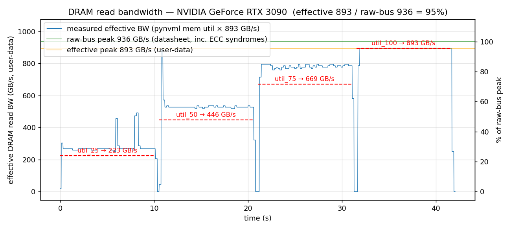
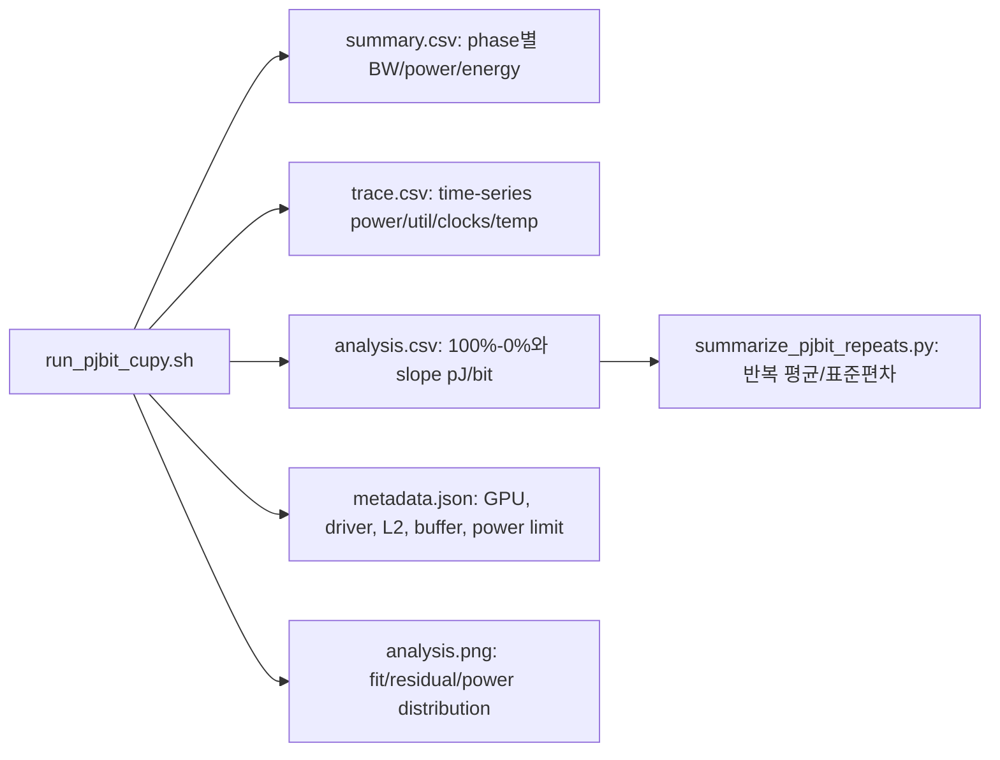

# DRAM Read Utilization 실험

GPU DRAM **read utilization** 을 **25% → 50% → 75% → 100%** 로 각각 10초씩
계단 형태로 강제 구동하고, 타임라인에서 검증하기 위한 자동화 도구 모음.

AccelWattch GPU 전력 모델 검증(특히 DRAM 전력 항) 에서 **원하는 BW utilization
수준을 제어한 microbenchmark** 가 필요해서 만들었음.

## 두 가지 구현 방식

| 구현 | 요구사항 | 검증 방법 | 특징 |
|---|---|---|---|
| **CuPy (Python)** | `pip` 만 (nvcc / CUDA toolkit 불필요) | `pynvml` 폴링 → CSV + PNG | 빠르게 재현, 그래프 자동 생성 |
| **Native CUDA (C++)** | `nvcc` + `nsys` | Nsight Systems 타임라인 | 세밀한 프로파일, GPU Metrics 샘플링 |

RTX 3090 (WSL2) 에서 CuPy 버전으로 바로 검증 완료 — `reports/` 하위 PNG 참조.

## 원리

- **커널**: L2 보다 훨씬 큰 전역 float4 버퍼를 `__ldcg` 로 스트리밍 read →
  피크 DRAM read BW 포화.
- **Host-side duty cycling**: 20 ms 윈도우 안에서 `target%` 만큼만 커널을
  실행하고 나머지는 `sleep` → 10 s 평균으로 DRAM read utilization 이
  25/50/75/100% 로 수렴.
- **NVTX range**: 각 phase 를 `util_25 / util_50 / util_75 / util_100` 로 라벨,
  경계는 0.5 s `gap` range 로 분리.
- **CuPy 버전**은 100% phase 도 동일 duty cycle 로 처리 (WSL2 WDDM TDR 방지).
  Native 버전은 100% 를 단일 커널 런치로 구동.

## 파일

| 파일 | 설명 |
|---|---|
| `dram_util_cupy.py` | **CuPy 버전** — NVRTC 로 커널 JIT + pynvml 폴링 + 자동 플롯 (GB/s + %) |
| `dram_pjbit_cupy.py` | **Read/Write pJ/bit 측정** — streaming read/write + NVML power integration + CSV/PNG |
| `run_cupy.sh` | CuPy 버전 launcher (`cupy/nvtx/pynvml` 있는 python 자동 탐지) |
| `run_pjbit_cupy.sh` | pJ/bit 측정 launcher (`cupy/nvtx/pynvml/matplotlib` 환경 자동 탐지) |
| `summarize_pjbit_repeats.py` | 여러 `*_analysis.csv` 반복 run의 pJ/bit 평균/표준편차 요약 |
| `run_nsys_cupy.sh` | **CuPy 스크립트를 nsys 로 프로파일링** (NVTX + GPU Metrics) |
| `dram_util.cu` | Native CUDA 스트리밍 read 커널 + 호스트 duty cycling |
| `Makefile` | `SM` 변수로 arch 지정 (기본 `sm_86` = RTX 3090) |
| `run_nsys.sh` | C++ 빌드 + `nsys profile` (GPU metrics 샘플링) + sqlite + 분석 |
| `run_nsys_a100.sh` | A100 80GB 프리셋 (`SM=80`, 버퍼 8 GiB) → `run_nsys.sh` 로 exec |
| `analyze.py` | nsys sqlite 에서 phase 별 DRAM read 지표 평균/표준편차 계산 |

## GPU 자동 대응

CuPy 가 `cudaGetDeviceProperties` 로 GPU 를 식별하므로 RTX 3090 / A100 / H100
모두 별도 설정 없이 동작한다.

- 버퍼 크기: `max(1 GiB, 64 × L2)` 자동 산정
  (RTX 3090 L2 6 MiB → 1 GiB, A100 L2 40 MiB → 2.5 GiB, H100 L2 50 MiB → 3.125 GiB)
- 피크 BW: 실제 1 pass 실행으로 calibration (HBM2e / GDDR6X 차이 자동 반영)
- 출력 파일명에 GPU slug 포함 → 여러 GPU 실험 결과 섞이지 않음
  예) `util_cupy_rtx_3090_20260417_141108.csv`, `util_cupy_a100_80gb_20260417_...csv`
- 다중 GPU 시스템은 `--device N` 으로 인덱스 선택

L2 크기는 반드시 고려해야 한다. `__ldcg` 는 L1을 우회하지만 L2를 완전히 우회하지는
않기 때문에, working set이 L2와 비슷하거나 작으면 DRAM bandwidth가 아니라 L2/cache
traffic이 섞인다. 따라서 H100처럼 L2가 큰 GPU에서는 RTX 3090 기준의 작은 버퍼를
그대로 쓰지 말고, 최소한 `64 × L2` 이상의 working set을 사용한다.

`64 × L2`는 물리 상수가 아니라 보수적인 휴리스틱이다. 목적은 한 pass 안의 reuse
distance를 L2보다 훨씬 크게 만들어, 다음 pass에서 같은 cache line을 다시 읽기 전에
대부분의 line이 이미 eviction되도록 하는 것이다. RTX 3090은 L2가 6 MiB라 `64 × L2`가
384 MiB지만, 기본 하한 `1 GiB` 때문에 실제로는 약 170 × L2를 사용한다. H100은 L2가
약 50 MiB라 `64 × L2`가 약 3.125 GiB가 되므로 RTX 3090의 1 GiB와 같은 절대 크기를
그대로 쓰는 것보다 더 방어적이다. 단, `64` 자체가 충분한지는 GPU/메모리 구조에 따라
달라질 수 있으므로 H100에서는 기본값과 8 GiB sensitivity run을 함께 비교한다.

## A. CuPy 버전 (권장, 빠른 재현)

### 설치 (이미 python 환경에 CuPy 가 있다면 `nvtx` 만 추가)

```bash
pip install cupy-cuda12x nvidia-cuda-nvrtc-cu12 pynvml nvtx matplotlib
```

- `cupy-cuda12x` : CUDA 12.x 런타임 (드라이버만 있으면 동작, nvcc 불필요)
- `nvidia-cuda-nvrtc-cu12` : libnvrtc (JIT 컴파일러). CuPy wheel 이 항상 포함하는 건 아님
- `pynvml` : memory-controller utilization 폴링
- `nvtx` : phase 라벨 (nsys 있을 때 타임라인에 표시)

### 실행

```bash
cd util/dram_util_experiment
./run_cupy.sh
# 또는 직접
python3 dram_util_cupy.py --targets 25 50 75 100 --phase-seconds 10
```

### 출력

- `reports/util_cupy_<gpu_slug>_<timestamp>.csv`
  컬럼: `t_s, mem_util_pct, gpu_util_pct, bandwidth_gbps, phase`
- `reports/util_cupy_<gpu_slug>_<timestamp>.png`
  좌 Y축: **DRAM read bandwidth (GB/s)** · 우 Y축: **utilization (%)**
  빨간 점선: 각 phase 의 target BW
- 콘솔에 phase 별 expected/measured GB/s 요약

예시 (RTX 3090, peak 719 GB/s):
```
phase       target   expected   measured      std      n
               (%)     (GB/s)     (GB/s)   (GB/s)
--------------------------------------------------------
util_25         25      179.7      204.4     72.3    474
util_50         50      359.3      369.9     67.7    477
util_75         75      539.0      518.6     61.6    476
util_100       100      718.7      706.6     92.3    477
```



### "DRAM bandwidth" 용어 정리 (중요)

두 수치를 혼동하면 A100 의 1779 GB/s 가 "2039 기대치보다 낮다" 는 잘못된 해석이 됨.

| 용어 | 의미 | 값 (A100 80GB) |
|---|---|---|
| **Raw-bus peak** (datasheet, "theoretical") | `2 × memoryClockRate × busWidth ÷ 8` — **HBM 물리 바스 전체 대역** (사용자 데이터 + ECC syndrome + 컨트롤러 헤더 모두 포함) | 2039 GB/s |
| **Effective (user-data) peak** | 프로그램이 load/store 로 실제 얻을 수 있는 상한 — ECC syndrome · refresh · controller overhead 제외 | ~1779 GB/s |

스크립트가 측정하는 것은 **effective BW** (buffer bytes / kernel time). A100 에서
1779 ≠ 2039 인 이유는 **측정 오류가 아니라 정의 차이**.

**효율 손실 분해 (A100 HBM2e, ECC on 기준)**

| 출처 | 사용자 BW 영향 | 설명 |
|---|---|---|
| **On-die ECC (ODECC)** | **0%** | HBM 다이 내부 correction. 바스 밖에서 투명 |
| **System-level ECC (in-band syndromes)** | **~10–12%** | syndrome 8B 가 사용자 데이터 64B 와 함께 HBM 바스를 점유 (64/72 ≈ 88.9%) |
| Refresh / tRRD·tFAW / controller | ~3–5% | ECC off 상태에서도 남는 손실 |
| **합계** | **~13–17%** → 실효 83–87% | |

→ A100 의 87% 달성은 **ODECC 때문이 아님**. 사용자 데이터 바스를 공유하는
**system-level ECC + 타이밍 오버헤드** 조합. HBM 다이 자체는 2039 GB/s raw 를
낼 수 있지만, 그 중 ~12% 가 syndrome 전송에 쓰임.

**GPU 별 기대 범위 (effective vs raw)**

| GPU | Raw-bus peak | Effective peak (streaming) | 효율 | 비고 |
|---|---|---|---|---|
| RTX 3090 (GDDR6X) | 936 GB/s | 880–900 GB/s | 93–96% | consumer, no ECC |
| A100 40GB (HBM2, ECC on)  | 1555 GB/s | 1350–1450 GB/s | 87–93% | |
| A100 80GB (HBM2e, ECC on) | 2039 GB/s | 1700–1800 GB/s | 83–88% | |
| H100 SXM (HBM3, ECC on)   | 3350 GB/s | 2700–3000 GB/s | 80–90% | |

**각 phase 의 target 은 effective peak 기준**:
- `util_100` → measured effective peak (raw 가 아님)
- `util_25` → effective peak × 0.25
- raw 와의 차이는 "scale up 가능한 여분" 이 아니라 **이 GPU 의 프로그램으로
  도달 불가능한 영역** (ECC/controller 가 점유)

**진단 출력 예시**:
```
[diag] ECC:          current=True pending=True   (ECC on → HBM 실효 BW ~ 이론치의 88–90%)
[diag] mem bus:      5120-bit
[diag] clocks now:   SM 1410 / max 1410 MHz,  MEM 1593 / max 1593 MHz
[calib] 1.380 ms/pass (best of 3)  ~1779.1 GB/s effective (user-data) DRAM read BW
[peak]  datasheet raw-bus peak  : 2039 GB/s  (physical clk×width, includes ECC overhead & controller)
[peak]  effective / raw          : 87.2%
        (GDDR: ~93–96% / HBM+ECC on: ~83–90%  →  이것이 이 GPU 의 프로그램 실효 상한)
[peak]  ECC on → system-level ECC syndromes 가 bus BW 의 ~10–12% 점유
        (on-die ECC 는 별개, bus 에 투명)
```

**효율이 기대 범위보다 낮을 때 체크 포인트**:

1. **ECC 상태**: `nvidia-smi -q -d ECC` → `Current: Enabled` 면 ~10% 손실 (정상, 데이터센터 GPU 필수).
   비활성화: `sudo nvidia-smi -e 0` 후 재부팅 (프로덕션 비권장, 메모리 용량도 ~6% 감소)
2. **클럭 throttling**: `nvidia-smi --query-gpu=clocks.mem,clocks.sm --format=csv` 가
   max 보다 낮으면 열/파워 제한. 스크립트가 pynvml 의 `throttle_reasons` 도 같이 표시
3. **파워 리밋**: `power.draw` ≈ `power.limit` 이면 파워 캡 걸린 상태.
   `sudo nvidia-smi -pl <watts>` 로 상향 가능
4. **Persistence mode**: `sudo nvidia-smi -pm 1` — 드라이버 언로드/재초기화 레이턴시 제거
5. **다른 프로세스**: `nvidia-smi` 로 GPU 점유 중인 백그라운드 확인
6. **TDR (WSL2)**: CuPy 버전은 duty cycle 로 장기 커널 타임아웃 우회 (100% phase 도 짧게 쪼갬)

### 주요 옵션

- `--device N` — CUDA 디바이스 인덱스 (다중 GPU 시스템)
- `--buf-bytes N` — 버퍼 크기 (기본 `max(1 GiB, 64 * L2)`)
- `--phase-seconds` — phase 당 길이 (기본 10)
- `--window-ms` — duty cycle 창 크기 (기본 20)
- `--targets 10 30 60 90` — 커스텀 계단
- `--poll-hz` — pynvml 폴링 주파수 (기본 50)
- `--tag NAME` — 출력 파일 추가 suffix (실험 변형 구분용)

### CuPy + nsys 프로파일링

`nsys` 가 있으면 pynvml 보다 정확한 DRAM throughput 시계열을 얻을 수 있음:

```bash
./run_nsys_cupy.sh                      # 기본
./run_nsys_cupy.sh --phase-seconds 5    # 시간 단축
./run_nsys_cupy.sh --no-metrics         # GPU metrics 샘플링 끔 (WSL2/권한 제약시)

# 결과 확인
nsys-ui reports/nsys_cupy_*.nsys-rep
```

타임라인에서 확인할 것:
- **NVTX 행** — `util_25 / util_50 / util_75 / util_100` 각 10 s + `gap`
- **GPU Metrics 행** — DRAM Read Throughput 이 25/50/75/100% 계단
- **CUDA HW → Kernels 행** — `stream_read` 커널 duty cycle 패턴

## B. Native CUDA + nsys (세밀한 프로파일링)

### 요구사항

- CUDA Toolkit 12.x 이상 (`nvcc`)
- Nsight Systems 2024.x 이상 (`nsys`)
- `--gpu-metrics-device` 사용 시:
  ```
  # /etc/modprobe.d/nvidia.conf
  options nvidia NVreg_RestrictProfilingToAdminUsers=0
  ```

### 실행

```bash
./run_nsys.sh            # RTX 3090 기본 (sm_86, 1 GiB)
./run_nsys_a100.sh       # A100 80GB (sm_80, 8 GiB)

# 수동
make SM=86
nsys profile -o report \
  --trace=cuda,nvtx --sample=none \
  --gpu-metrics-device=0 --gpu-metrics-frequency=10000 \
  ./dram_util
```

## 결과 확인

### 1. Nsight Systems GUI

```bash
nsys-ui reports/dram_util_*.nsys-rep
```

확인할 행:

- **GPU Metrics → DRAM Read Throughput** : 25/50/75/100% 계단
- **NVTX** : `util_25` / `util_50` / `util_75` / `util_100` (각 10 s) + `gap`
- **CUDA HW → Kernels** : `stream_read_kernel` 점유 패턴 (25% phase 는 20 ms 중 5 ms 만 점유 등)

### 2. CLI 자동 분석 (`analyze.py`)

`run_nsys.sh` 가 자동 실행. 예상 출력:

```
phase      metric                              target%     mean    stdev  samples
----------------------------------------------------------------------------------
util_25    DRAM Read Throughput                     25    25.3     2.1      1024
util_50    DRAM Read Throughput                     50    50.1     3.0      1024
util_75    DRAM Read Throughput                     75    74.8     2.4      1024
util_100   DRAM Read Throughput                    100    99.2     0.8      1024
```

목표치와 평균이 ±3% 이내면 실험 성공.

## 주의사항

- **WSL2**: `--gpu-metrics-device` 샘플링이 드라이버/nsys 버전에 따라 제한될 수
  있음. 실패 시 해당 플래그를 빼고 NVTX + 커널 타임라인만으로 점유율을 확인
  (kernel active time / phase time ≈ target util). CuPy 버전은 pynvml 로
  대체 검증 가능.
- **pynvml memory utilization**: "memory controller 가 busy 였던 시간 비율".
  NVML 내부 샘플 주기 (수백 ms) 때문에 분산이 있어 25% target 이 ~30% 로
  약간 높게 측정될 수 있음. 계단 구분은 뚜렷함.
- **L2 cache bypass**: 커널은 `__ldcg` 를 쓰고 버퍼 크기는 `max(1 GiB, 64 × L2)`
  로 자동 결정되어 read 가 전부 DRAM 까지 내려가도록 함.
- **Read-only**: 저장(`sink`) 은 dead store (센티넬 조건부) 이므로 DRAM write
  utilization 은 0 에 수렴. Read 를 측정하고 싶을 때만 쓸 것.
- **피크 BW 기준**: 각 GPU 이론 피크 대비 utilization 이므로, 실제 측정된 peak
  GB/s 는 calibration 로그의 `[calib] ... GB/s peak DRAM read` 값을 참고.
- **CuPy + libnvrtc**: `cupy-cuda12x` wheel 이 libnvrtc 를 항상 포함하지는
  않음. 로드 실패 시 `nvidia-cuda-nvrtc-cu12` 를 별도 설치. 스크립트는
  `.local/.../nvidia/cuda_nvrtc/lib/libnvrtc.so.12` 를 자동 preload.

## 확장

- **write utilization 실험**: 커널을 `sink[i] = v` 형태로 바꾸면 DRAM write 버전.
- **다른 계단 (예: 10/30/60/90)**: CuPy 는 `--targets 10 30 60 90`,
  Native 는 `dram_util.cu` 의 `targets[]` 수정.
- **phase 길이 변경**: CuPy 는 `--phase-seconds`, Native 는 `phase_ms`.
- **duty 윈도우 변경**: CuPy 는 `--window-ms`, Native 는 `window_ms`
  (기본 20.0). 더 작게 하면 그래프가 더 평탄해지지만 런치 오버헤드 비중이 커짐.

## C. Read/Write pJ/bit 측정 (CuPy)

`dram_pjbit_cupy.py` 는 기존 read-utilization 실험을 확장해서 **read / write** 각각에 대해
DRAM 스트리밍 bandwidth, NVML power trace, dynamic energy, pJ/bit 을 한 번에 계산한다.

> 중요: 일반 NVIDIA GPU에서 NVML은 DRAM rail 전용 power를 제공하지 않는다. 따라서 여기서의
> `dynamic_power_w` / `pJ_per_bit` 은 **idle baseline을 뺀 GPU/board marginal power**를
> 해당 read/write traffic에 귀속한 값이다. DRAM rail-only 값을 의미하지 않는다.

### 실험 목적

이 실험의 목적은 AccelWattch/DRAM power model 보정에 쓸 수 있는
**DRAM traffic bit당 board-level marginal energy** 를 얻는 것이다.

- `read`: DRAM에서 GPU 쪽으로 user-data를 streaming load할 때의 marginal energy.
- `write`: GPU에서 DRAM으로 user-data를 streaming store할 때의 marginal energy.
- `target=0`: 같은 실행 환경에서 kernel을 실행하지 않고 power만 적분하는 phase-local baseline.
- `target=25/50/75/100`: calibration된 effective user-data peak bandwidth 대비 duty target.

따라서 결과는 "HBM/GDDR DRAM rail-only pJ/bit" 이 아니라,
**DRAM traffic을 만들기 위해 함께 켜지는 memory controller, L2 경로, SM issue,
load/store unit, clock/P-state 변화까지 포함한 GPU/board 관측값** 으로 해석해야 한다.

### 실험 방법: 순서와 데이터 흐름

전체 실험은 "DRAM traffic을 의도적으로 만들고, 같은 시간 구간의 board-level power를
적분한 뒤, bandwidth 변화에 대한 marginal energy slope를 구하는" 절차다.

```mermaid
flowchart TD
    A[환경 확인: GPU 단독 사용, power limit, clocks, nvidia-smi] --> B[GPU 속성 조회: SM 수, L2 size, CUDA/NVML]
    B --> C[Working set 결정: max(1 GiB, 64 x L2), 필요 시 8 GiB sensitivity run]
    C --> D[Read/write kernel JIT: L1 우회 read, streaming write]
    D --> E[Calibration: 1 pass time 측정, effective peak GB/s 계산]
    E --> F[Idle 측정: kernel 없이 NVML power trace 수집]
    F --> G[Target phases: 0/25/50/75/100 percent read/write]
    G --> H[각 phase에서 bytes, wall time, avg power, clocks, temp, P-state 기록]
    H --> I[Post-analysis: 100%-0% delta와 50/75/100 slope 계산]
    I --> J[반복 run 요약: 평균, 표준편차, R2, residual 확인]
```

세부 순서는 다음과 같다.

1. `nvidia-smi` 로 다른 compute process가 없는지 확인하고, power limit, 온도, P-state를 기록한다.
2. 스크립트가 CUDA device property에서 L2 size를 읽고, 기본 buffer를 `max(1 GiB, 64 x L2)`로 잡는다.
3. `read` 커널은 `__ldcg` load로 L1을 우회해 큰 `float4` buffer를 읽고, `write` 커널은 같은 크기의 buffer에 streaming store한다.
4. 각 mode마다 1 pass 시간을 먼저 calibration해서 이 GPU/이 실행환경의 effective peak GB/s를 얻는다.
5. `idle-seconds` 동안 kernel 없이 NVML power를 수집해 pre-idle baseline을 만든다.
6. `target=0` phase는 같은 phase 길이 동안 kernel을 실행하지 않고 phase-local baseline으로 저장한다.
7. `target=25/50/75/100` phase는 calibration peak 대비 목표 bandwidth가 나오도록 host-side duty cycle을 조절한다.
8. phase별 `bytes_transferred`, `bandwidth_gbps`, `avg_power_w`, `power distribution`, clocks, temperature, P-state, throttle reason을 저장한다.
9. 실험 종료 후 `100%-0%` 방식과 `avg_power_w = intercept + slope x bandwidth_gbps` 방식을 자동 계산한다.
10. 같은 조건을 3회 이상 반복하고 `slope_avg_power_vs_bw` 의 평균/표준편차와 R2/residual을 확인한다.

출력 파일의 역할은 아래와 같다.



### 관련 연구와 방법론 체크

- [GPUWattch](https://doi.org/10.1145/2485922.2485964)는 microbenchmark와 실제
  hardware power 측정을 함께 써서 GPU power model을 검증했다. 이 실험도 같은 방향으로,
  제어된 DRAM traffic을 만들고 board-level power의 marginal slope를 추정한다.
- [AccelWattch](https://engineering.purdue.edu/tgrogers/publication/kandiah-micro-2021/)는
  modern GPU의 cycle-level power와 constant/static power까지 모델링하려는 프레임워크다.
  따라서 측정값을 DRAM rail-only 상수로 바로 넣기보다, AccelWattch의 DRAM/memory-subsystem
  항을 보정하는 board-level calibration anchor로 쓰는 것이 안전하다.
- [MEMPower](https://link.springer.com/chapter/10.1007/978-3-030-18656-2_15)는 GPU memory
  access energy가 data pattern, core, channel에 따라 달라질 수 있음을 보인다. 현재 스크립트는
  streaming read/write의 평균 marginal cost를 보는 용도이며, data-dependent energy까지 보려면
  all-zero, all-one, random, high-toggle pattern을 별도 run으로 추가한다.
- [NVML 문서](https://docs.nvidia.com/deploy/archive/R550/nvml-api/group__nvmlDeviceQueries.html)는
  `nvmlDeviceGetPowerUsage`가 GPU와 memory 등 associated circuitry power를 보고하며,
  GA10x Ampere에서는 약 1초 평균 power를 반환한다고 설명한다. 그래서 phase를 20초 이상으로
  두고 `100%-0%` 한 점보다 multi-point slope를 우선한다.
- [Nsight Systems GPU Metrics](https://docs.nvidia.com/nsight-systems/UserGuide/)는
  DRAM read/write bandwidth counter를 직접 샘플링할 수 있다. 설치되어 있으면 NVML 기반
  effective BW와 Nsight DRAM throughput 계단이 맞는지 cross-check한다.

### 공개 pJ/bit 수치와 비교 범위

아래 값은 메모리 device/PHY 관점의 공개 수치 또는 업계 추정치다. 이 저장소의 RTX 3090
측정값처럼 NVML board power에서 추정한 값과 직접 같은 물리량이 아니다.

| Memory | 공개/문헌상 대략 범위 | 해석 |
|---|---:|---|
| GDDR7 | 4.5 pJ/bit | [Micron graphics memory 비교표](https://www.micron.com/products/memory/graphics-memory)의 average device power 기준 |
| GDDR6X | 6-7.25 pJ/bit | Micron graphics memory/GDDR6X 자료 기준. 세대/속도 bin/측정 조건에 따라 차이 |
| HBM3 | 약 3-5 pJ/bit | 공개 기술 요약의 추정 범위. 제조사별 exact value는 보통 비공개 |
| HBM3E | 약 2.5-4 pJ/bit | 공개 기술 요약의 추정 범위. [Micron HBM3E](https://www.micron.com/products/memory/hbm/hbm3e)는 exact number 대신 경쟁 제품보다 최대 30% 낮은 power라고 공개 |

따라서 공개 자료만 놓고 보면 HBM3/HBM3E는 GDDR7보다 대략 1.2-2배 낮은 pJ/bit 범위에
있는 것으로 보는 것이 보수적이다. 단, 이 비교는 device-level energy이고,
본 실험의 `30 pJ/bit` 수준 RTX 3090 결과는 memory controller, L2/SM path, clock/P-state 변화,
board power가 포함된 marginal board-level 값이다.

### 권장 실험 환경

측정값은 power management와 백그라운드 load에 민감하다. 가능하면 아래 조건을 맞춘다.

- GPU 단독 사용: `nvidia-smi` 로 다른 compute process가 없는지 확인.
- MIG 비활성 또는 full GPU 사용: MIG instance에서는 NVML power가 전체 GPU 기준으로만 보이거나 제한될 수 있다.
- Persistence mode enabled: `sudo nvidia-smi -pm 1`.
- H100/A100 같은 datacenter GPU는 ECC on 상태가 일반적이며, 이 상태의 effective BW를 기준으로 해석한다.
- thermal/power throttling이 없도록 충분히 식힌 뒤 실행한다.
- 같은 조건에서 2~3회 반복하고, 50/75/100% 구간의 slope가 안정적인지 확인한다.

### Python 환경 준비

CUDA toolkit이나 `nvcc` 는 필요 없다. 드라이버와 CUDA runtime wheel, NVRTC wheel만 있으면 된다.

```bash
cd util/dram_util_experiment

python3 -m venv .venv-pjbit
source .venv-pjbit/bin/activate

pip install -U pip
pip install cupy-cuda12x nvidia-cuda-nvrtc-cu12 pynvml nvtx matplotlib numpy

python -c "import cupy, nvtx, pynvml, matplotlib; print(cupy.cuda.runtime.getDeviceProperties(0)['name'])"
nvidia-smi
```

이미 `cupy/nvtx/pynvml/matplotlib` 이 설치된 conda/venv가 있으면 그 환경에서 바로 실행해도 된다.
`run_pjbit_cupy.sh` 는 `/home/bang001/miniforge3/envs/ssc21env/bin/python` 과 `python3` 중
필요 패키지를 import할 수 있는 Python을 자동으로 고른다.

### H100 실행 예시

H100에서는 phase가 너무 짧으면 boost/thermal/power transition 영향이 커질 수 있으므로
`phase-seconds=10~20`, `idle-seconds=10~15` 를 권장한다.

```bash
cd util/dram_util_experiment

./run_pjbit_cupy.sh \
  --modes read write \
  --targets 0 25 50 75 100 \
  --phase-seconds 10 \
  --idle-seconds 10 \
  --poll-hz 100 \
  --tag h100_zero
```

더 안정적인 보고용 값이 필요하면 phase를 길게 잡는다.

```bash
./run_pjbit_cupy.sh \
  --modes read write \
  --targets 0 25 50 75 100 \
  --phase-seconds 20 \
  --idle-seconds 15 \
  --poll-hz 100 \
  --tag h100_zero_long
```

다중 GPU 시스템에서는 `--device N` 으로 H100 인덱스를 명시한다.

```bash
./run_pjbit_cupy.sh --device 1 --modes read write --targets 0 50 75 100 --tag h100_gpu1
```

H100은 L2가 약 50 MiB이므로 기본 버퍼는 자동으로 약 3.125 GiB가 된다.
실행 시작 로그에서 아래처럼 L2와 buffer size를 확인한다.

```text
[info] GPU=... H100 ... L2=50.0 MiB buf=3.12 GiB ...
```

최종 보고용으로는 기본값 한 번, 더 보수적인 8 GiB working set 한 번을 모두 실행해서
`slope_avg_power_vs_bw` pJ/bit가 크게 변하지 않는지 확인하는 것을 권장한다.

```bash
./run_pjbit_cupy.sh \
  --modes read write \
  --targets 0 25 50 75 100 \
  --buf-bytes 8589934592 \
  --phase-seconds 20 \
  --idle-seconds 15 \
  --poll-hz 100 \
  --tag h100_8gib
```

8 GiB run은 기본값을 대체하는 필수 설정이 아니라 **sensitivity check** 다. 목적은 다음과 같다.

- H100의 50 MiB L2, page/channel/bank interleaving, controller 정책 때문에 working set 크기에 따라
  pJ/bit가 달라지는지 확인한다.
- 기본값 `64 x L2`가 이미 충분한지 검증한다. RTX 3090은 6 MiB L2라 1 GiB만으로도 170배 이상 크지만,
  H100은 L2가 훨씬 크고 HBM stack/channel 구조도 다르므로 한 번 더 보수적으로 확인한다.
- 8 GiB 결과와 기본 buffer 결과의 `slope_avg_power_vs_bw`가 비슷하면, 측정값이 cache 용량이나
  특정 address range에 과도하게 의존하지 않는다는 근거가 된다.

주의할 점은 큰 buffer에서 `--window-ms` 가 너무 짧으면 한 번의 pass 시간이 duty-cycle window와
비슷해져 target 25/50/75%가 모두 비슷한 bandwidth로 양자화될 수 있다는 것이다. 그런 경우에는
`--window-ms 100` 또는 `--window-ms 200`처럼 window를 늘려야 한다.
스크립트는 calibration 후 target별 pass/window가 너무 작으면 `[warn] ... duty window may quantize`
경고를 출력한다. 이 경고가 보이면 해당 run의 25/50/75% pairwise 결과는 해석에서 제외하고
window를 키워 다시 측정한다.

### 계산식

1. L2보다 큰 버퍼를 만든다: `max(1 GiB, 64 × L2)`.
2. `stream_read` 또는 `stream_write` 1 pass 시간을 calibration해서 각 mode의 peak GB/s를 구한다.
3. idle baseline power `P_idle` 을 NVML로 먼저 측정한다.
4. 각 phase에서 실제 실행한 `launches × passes × buffer_bytes` 를 byte 수로 기록한다.
5. NVML power trace를 trapezoid integration해서 `E_total` 을 구하고, 다음을 계산한다.

```text
E_dyn      = max(0, E_total - P_idle × wall_time)
BW_GBps    = transferred_bytes / wall_time / 1e9
pJ_per_bit = E_dyn / (transferred_bytes × 8) × 1e12
           = dynamic_power_W × 1000 / (8 × BW_GBps)
```

`target=0` 은 예외적으로 kernel launch를 하지 않는다. 같은 phase 길이 동안 NVML power만
기록하며, CSV에는 `bandwidth_gbps=0`, `bytes_transferred=0`, `pj_per_bit=nan` 으로 남는다.
RTX 3090 같은 GA10x Ampere GPU는 NVML power가 약 1초 평균으로 보고되므로,
`phase-seconds` 는 최소 10초, 보고용은 20초 이상을 권장한다.

### 기본 실행

```bash
cd util/dram_util_experiment
./run_pjbit_cupy.sh --modes read write --targets 100 --phase-seconds 5 --idle-seconds 5
```

여러 utilization point를 같이 보고 싶으면 다음처럼 실행한다.

```bash
./run_pjbit_cupy.sh --modes read write --targets 25 50 75 100 --phase-seconds 10
```

0% baseline까지 같은 run에 포함하려면 다음처럼 실행한다.

```bash
./run_pjbit_cupy.sh --modes read write --targets 0 25 50 75 100 --phase-seconds 10 --idle-seconds 10
```

### 출력

- `reports/pjbit_cupy_<gpu>_<timestamp>_summary.csv`
  - `mode,target_pct,bandwidth_gbps,avg_power_w,dynamic_power_w,dynamic_energy_j,pj_per_bit,...`
  - phase별 power 분포 진단용 `power_std_w,power_min_w,power_p05_w,power_p50_w,power_p95_w,power_max_w`
  - `dynamic_*` 와 `pj_per_bit` 는 pre-idle baseline 기준 진단값이다. 최종 보고값은
    `*_analysis.csv` 의 `slope_avg_power_vs_bw` 를 우선한다.
- `reports/pjbit_cupy_<gpu>_<timestamp>_trace.csv`
  - `t_s,power_w,gpu_util_pct,mem_util_pct,sm_clock_mhz,mem_clock_mhz,temp_gpu_c,pstate,throttle_reasons_hex,phase`
- `reports/pjbit_cupy_<gpu>_<timestamp>_analysis.csv`
  - 실험 종료 후 자동 계산한 `100%-0%` phase-local pJ/bit, 모든 target pair의
    `pair_delta_avg_power`, `50/75/100` slope 기반 pJ/bit, slope fit의 `R²`, maximum residual
- `reports/pjbit_cupy_<gpu>_<timestamp>_metadata.json`
  - GPU name/UUID, driver/CUDA version, L2/buffer size, clocks, P-state, temperature,
    power limit, throttle reasons, calibration peak BW, idle power statistics
- `reports/pjbit_cupy_<gpu>_<timestamp>.png`
  - power timeline, phase별 bandwidth, phase별 dynamic pJ/bit bar plot
- `reports/pjbit_cupy_<gpu>_<timestamp>_analysis.png`
  - `avg_power_w` vs `bandwidth_gbps` 회귀선, `100%-0%` vs slope pJ/bit 비교,
    fit residual, phase별 power distribution boxplot
- `reports/pjbit_method.png`
  - pJ/bit 계산 flow를 확인하기 위한 구현/계산식 요약 이미지

### Read vs Write 커널

- `read`: `__ldcg` 로 `float4` buffer를 streaming load한다. L1을 우회하고 L2/DRAM 경로에 pressure를 준다.
- `write`: 같은 크기의 `float4` buffer 전체를 streaming store한다. 계산되는 byte 수는 user-data write byte 기준이다.
- 두 경우 모두 기본 working set이 L2보다 훨씬 크기 때문에 DRAM-dominant access가 되도록 설계되어 있다.

### 결과 해석 방법

CSV의 `pj_per_bit` 는 pre-idle baseline `P_idle` 을 뺀 값이다. 하지만 GPU power는 phase 순서,
P-state, display load, thermal 상태에 따라 흔들릴 수 있으므로 아래 세 가지 관점으로 같이 본다.
스크립트는 실험 종료 후 아래 2-4번의 값을 자동으로 계산해서 콘솔에 `post-analysis` 표로
출력하고, 같은 내용을 `*_analysis.csv` 로 저장한다. 또한 `*_analysis.png` 에서 회귀선,
estimator 비교, residual, phase별 power 분포를 함께 확인할 수 있다.

#### 1. Script 기본값: pre-idle baseline 기준

CSV의 `dynamic_power_w`, `dynamic_energy_j`, `pj_per_bit` 가 이 방식이다.

```text
E_dyn      = max(0, E_total - P_idle × wall_time)
pJ_per_bit = E_dyn / (bytes_transferred × 8) × 1e12
```

장점은 모든 phase가 같은 pre-idle 기준을 쓴다는 점이다. 단점은 pre-idle power가 이후
0% phase power와 다르면 저부하 구간의 pJ/bit가 과소/과대평가될 수 있다는 점이다.

#### 2. 100%-0% phase-local delta

사용자가 원하는 "100%에서 0%를 뺀 뒤 bit 수로 나누기" 는 다음 계산이다.

```text
delta_power_W = avg_power_w(target=100) - avg_power_w(target=0)
pJ_per_bit_100_minus_0 = delta_power_W × 1000 / (8 × bandwidth_gbps(target=100))
```

이 값은 phase-local baseline을 쓰기 때문에 pre-idle drift를 줄일 수 있다.
다만 `100%` 에서 추가로 바뀌는 clock, memory controller state, SM issue, L2 path power까지
함께 포함하므로 여전히 DRAM rail-only 값은 아니다.

#### 3. 모든 target pair delta

`100%-0%` 한 점만 보면 0% phase의 power 상태에 민감할 수 있다. 그래서 스크립트는
모든 target pair에 대해 다음 값을 `pair_delta_avg_power` 로 저장한다.

```text
delta_power_W = avg_power_w(target=high) - avg_power_w(target=low)
delta_bw_GBps = bandwidth_gbps(target=high) - bandwidth_gbps(target=low)
pJ_per_bit_pair = delta_power_W x 1000 / (8 x delta_bw_GBps)
```

해석은 다음과 같다.

- `75-50`, `100-75`, `100-50` 이 slope 값과 비슷하면 고부하 구간의 marginal cost가 안정적이다.
- `50-25`, `50-0`, `75-0`, `100-0` 이 더 크면 저부하에서 clock/P-state/memory-controller
  wake-up cost가 함께 들어간다는 뜻이다.
- 모든 pair가 같은 값이어야만 하는 것은 아니다. 오히려 pair별 차이가 크면 단일 DRAM rail-only
  pJ/bit로 해석하면 안 된다는 경고 신호다.

계산 예시:

```bash
python3 - <<'PY'
import csv, glob

p = sorted(glob.glob("reports/*_summary.csv"))[-1]
rows = list(csv.DictReader(open(p)))
by = {(r["mode"], int(r["target_pct"])): r for r in rows}

for mode in ["read", "write"]:
    r0 = by[(mode, 0)]
    r100 = by[(mode, 100)]
    p0 = float(r0["avg_power_w"])
    p100 = float(r100["avg_power_w"])
    bw100 = float(r100["bandwidth_gbps"])
    pjbit = (p100 - p0) * 1000.0 / (8.0 * bw100)
    print(f"{mode}: P0={p0:.3f} W P100={p100:.3f} W "
          f"BW100={bw100:.3f} GB/s  100-0={pjbit:.6f} pJ/bit")
PY
```

#### 4. 권장 보고값: multi-point slope

논문/보고서용으로는 `avg_power_w = intercept + slope × bandwidth_gbps` 를
50/75/100% 또는 25/50/75/100% point에 fitting하고, slope를 pJ/bit로 바꾸는 방식을 권장한다.

```text
pJ_per_bit_slope = slope_W_per_GBps × 1000 / 8
```

이 방식은 0% 한 점의 power drift에 덜 민감하고, bandwidth 증가에 따른 marginal cost를 직접 본다.
저부하 25% 값이 launch overhead나 power-state 전이 때문에 튀면 50/75/100%만 fitting한다.
`*_analysis.csv` 의 `r2` 가 1에 가깝고 `max_abs_residual_w` 가 작을수록 이 선형 marginal
energy 모델이 해당 실험 구간을 잘 설명한다는 뜻이다.

계산 예시:

```bash
python3 - <<'PY'
import csv, glob

p = sorted(glob.glob("reports/*_summary.csv"))[-1]
rows = list(csv.DictReader(open(p)))

for mode in ["read", "write"]:
    pts = [
        (float(r["bandwidth_gbps"]), float(r["avg_power_w"]))
        for r in rows
        if r["mode"] == mode and int(r["target_pct"]) in (50, 75, 100)
    ]
    n = len(pts)
    sx = sum(x for x, _ in pts)
    sy = sum(y for _, y in pts)
    sxx = sum(x * x for x, _ in pts)
    sxy = sum(x * y for x, y in pts)
    slope = (n * sxy - sx * sy) / (n * sxx - sx * sx)
    intercept = (sy - slope * sx) / n
    pjbit = slope * 1000.0 / 8.0
    print(f"{mode}: slope={slope:.6f} W/(GB/s), "
          f"intercept={intercept:.3f} W, slope_pJbit={pjbit:.6f}")
PY
```

### RTX 3090 반복 측정 결과

2026-05-13에 RTX 3090에서 아래 조건으로 3회 반복 측정했다.

- GPU/driver: NVIDIA GeForce RTX 3090, driver 591.86
- CUDA: runtime 12090, driver API 13010
- L2/buffer: 6 MiB L2, 1 GiB working set
- power limit: 370 W
- command: `--modes read write --targets 0 25 50 75 100 --phase-seconds 20 --idle-seconds 15`
- calibration peak: read 891-893 GB/s, write 847-856 GB/s effective user-data BW

`reports/rtx3090_repeat_summary.csv` 요약:

| mode | method | points | runs | pJ/bit mean | pJ/bit std | R2 mean | mean max residual |
|---|---|---:|---:|---:|---:|---:|---:|
| read | 100%-0% avg power | 0,100 | 3 | 44.368 | 0.807 | - | - |
| read | 50/75/100 slope | 50,75,100 | 3 | 30.487 | 0.340 | 0.999431 | 1.386 W |
| write | 100%-0% avg power | 0,100 | 3 | 43.203 | 1.068 | - | - |
| write | 50/75/100 slope | 50,75,100 | 3 | 30.690 | 0.855 | 0.999906 | 0.439 W |

이 결과에서는 `100%-0%` 방식이 read/write 모두 약 43-44 pJ/bit로 더 크게 나오고,
multi-point slope는 약 30.5-30.7 pJ/bit로 더 안정적이다. 해석상 최종 calibration에는
slope 기반 값을 우선 사용하고, `100%-0%` 값은 phase-local baseline sanity check로 같이 보고한다.
H100 결과도 같은 방식으로 두 estimator를 모두 저장하되, 최종 판단은 반복 run의 slope 평균/표준편차와
R2/residual을 함께 본다.

동일한 3회 반복 run에서 pairwise delta를 모두 계산하면 다음과 같다.

| pair | read mean pJ/bit | write mean pJ/bit | 해석 |
|---|---:|---:|---|
| 50-25 | 51.830 | 55.261 | 저부하 전이/clock state 영향이 큼 |
| 50-0 | 58.098 | 54.258 | 0% baseline과 50% state 차이가 큼 |
| 75-25 | 41.338 | 42.720 | 25% 구간 포함으로 slope보다 큼 |
| 75-50 | 30.986 | 30.425 | 고부하 marginal cost, slope와 유사 |
| 75-0 | 48.832 | 46.094 | 0% baseline 포함으로 큼 |
| 100-25 | 37.772 | 39.699 | 25% 구간 포함으로 slope보다 큼 |
| 100-50 | 30.491 | 30.712 | 고부하 marginal cost, slope와 유사 |
| 100-75 | 30.023 | 31.139 | 고부하 marginal cost, slope와 유사 |
| 100-0 | 44.368 | 43.203 | phase-local 0% 대비 값, slope보다 큼 |

즉 모든 pair가 30 pJ/bit로 나오지는 않는다. RTX 3090에서는 50% 이상 고부하 구간끼리의
incremental cost만 약 30 pJ/bit이고, 0% 또는 25%를 포함하는 pair는 38-58 pJ/bit로 커진다.
이는 낮은 utilization에서 memory subsystem/clock/P-state가 켜지는 비용이 같이 들어간다는 뜻이다.

### RTX 3090 1 GiB vs 8 GiB 확인

같은 RTX 3090에서 H100 실험과 맞추기 위해 8 GiB working set도 단일 run으로 확인했다.
8 GiB에서는 1 pass가 약 10 ms라 기본 `--window-ms 20`으로는 25/50/75% target이 거칠게
양자화되므로, 아래 결과는 `--window-ms 200`으로 다시 측정한 값이다.

```bash
./run_pjbit_cupy.sh --modes read write --targets 0 25 50 75 100 \
  --buf-bytes 8589934592 \
  --phase-seconds 20 \
  --idle-seconds 15 \
  --poll-hz 100 \
  --window-ms 200 \
  --tag rtx3090_8gib_h100criteria_w200
```

| mode | estimator | 1 GiB repeat mean ± std | 8 GiB single run | 해석 |
|---|---:|---:|---:|---|
| read | 100%-0% avg power | 44.368 ± 0.807 | 43.502 | 거의 동일 |
| read | 50/75/100 slope | 30.487 ± 0.340 | 29.145 | 약 4.4% 낮음, 같은 30 pJ/bit 근방 |
| write | 100%-0% avg power | 43.203 ± 1.068 | 43.845 | 거의 동일 |
| write | 50/75/100 slope | 30.690 ± 0.855 | 31.065 | 거의 동일 |

8 GiB 단일 run의 고부하 pairwise 값은 read `75-50=28.458`, `100-50=29.219`,
`100-75=30.458` pJ/bit이고 write `75-50=31.199`, `100-50=31.055`,
`100-75=30.850` pJ/bit이다. 따라서 buffer를 1 GiB에서 8 GiB로 키워도 결론은
크게 바뀌지 않았다. 다만 read slope의 약 4% 차이는 단일 run 기준이므로, H100 최종
보고에서는 기본 buffer와 8 GiB를 각각 3회 이상 반복해 평균/표준편차로 판단한다.

### RTX 3090 buffer/window sweep

2026-05-14에 confidence를 높이기 위해 buffer size와 duty-cycle window를 분리해서 추가 검증했다.
이 sweep은 L2 hit가 결과를 지배하는지, 그리고 `--window-ms`가 target bandwidth를 왜곡하는지 확인하기
위한 것이다. 현재 환경에는 `ncu`/`nsys`가 없어 L1/L2 hit-rate counter를 직접 읽지는 못했다.
다만 커널이 read에서는 `__ldcg`로 L1을 우회하고, working set이 RTX 3090 L2 6 MiB보다 최소 1 GiB로
매우 크기 때문에 L1/L2 hit rate는 설계상 거의 0에 가까워야 한다. H100 최종 실험에서는 Nsight Compute로
`l1tex`/`lts` hit-rate counter를 추가 확인하는 것이 좋다.

조건:

- GPU: RTX 3090
- targets: `0 25 50 75 100`
- modes: `read write`
- phase/idle: `--phase-seconds 20 --idle-seconds 15`
- polling: `--poll-hz 100`
- buffer sweep: `1/2/4/8 GiB`, `--window-ms 200`, 각 3회 반복
- window sweep: `8 GiB`, `--window-ms 20/50/100/200/400`, 각 1회

집계 CSV는 local `reports/` 아래에 남겨 둔다. `reports/`는 git ignore 대상이므로, 재현 가능한 요약은
아래 표를 기준으로 문서화한다.

| file | 내용 |
|---|---|
| `reports/pjbit_buffer_sweep_w200_summary.csv` | 1/2/4/8 GiB 반복 평균 |
| `reports/pjbit_buffer_sweep_w200_runs.csv` | buffer sweep의 개별 run 값 |
| `reports/pjbit_8gib_window_sweep_summary.csv` | 8 GiB window sweep 요약 |

Buffer sweep 결과:

| buffer | read slope pJ/bit | write slope pJ/bit | read 100%-0% | write 100%-0% | 해석 |
|---:|---:|---:|---:|---:|---|
| 1 GiB | 28.891 ± 0.271 | 30.907 ± 0.550 | 43.659 | 43.713 | RTX 3090 L2 대비 약 170배 |
| 2 GiB | 30.127 ± 0.773 | 31.627 ± 0.164 | 44.498 | 44.527 | 1 GiB와 같은 범위 |
| 4 GiB | 30.501 ± 1.195 | 32.380 ± 0.389 | 44.782 | 45.132 | write가 약간 높지만 결론 유지 |
| 8 GiB | 30.063 ± 0.758 | 31.297 ± 0.405 | 44.631 | 44.113 | 큰 buffer에서도 결론 유지 |

이 결과에서 buffer를 1 GiB에서 8 GiB로 키워도 slope 기반 marginal estimate는 read 약
`29-30.5 pJ/bit`, write 약 `31-32.4 pJ/bit` 범위에 머문다. 만약 L2/cache hit가 결과를
지배했다면 buffer size 증가에 따라 더 큰 변화가 보여야 한다. 따라서 RTX 3090 결과는
working-set 크기에 대한 민감도가 작고, DRAM-dominant streaming 실험으로 보는 것이 타당하다.
반면 `100%-0%`는 계속 약 `44-45 pJ/bit`로 높다. 이는 순수 DRAM cell/interface energy라기보다
clock/P-state, memory controller, L2/NoC/SM path 활성화 비용이 섞인 상한성 sanity check로 해석한다.

Window sweep 결과:

| window-ms | read slope pJ/bit | write slope pJ/bit | 25% pass/window | 판단 |
|---:|---:|---:|---:|---|
| 20 | 28.945 | 28.522 | read 0.52, write 0.49 | invalid: 25/50/75% target quantization 발생 |
| 50 | 32.094 | 31.324 | read 1.30, write 1.21 | marginal: low target 경고 |
| 100 | 31.151 | 32.231 | read 2.60, write 2.43 | marginal: low target 경고 |
| 200 | 29.637 | 31.966 | read 5.19, write 4.85 | valid |
| 400 | 28.596 | 30.215 | read 10.38, write 9.71 | valid |

8 GiB에서 `--window-ms 20`은 실제로 깨졌다. 예를 들어 read 25/50%가 각각 약
`408/416 GB/s`, write 25/50/75%가 약 `410/417/417 GB/s`로 뭉쳐 target separation이
사라졌다. `--window-ms 50`과 `100`도 low-target pass/window가 부족하다는 경고가 남는다.
따라서 8 GiB 또는 H100처럼 큰 buffer를 쓰는 조건에서는 `--window-ms 200` 이상을 권장한다.
`200`과 `400` 사이에서 slope 결론은 크게 바뀌지 않는다.

최종적으로 RTX 3090 기준으로 confidence 높은 값은 NVML board-level marginal estimate로
read 약 `30 pJ/bit`, write 약 `31-32 pJ/bit`이다. 이 값은 DRAM rail-only pJ/bit가 아니라,
해당 DRAM traffic을 만들기 위해 GPU board power에서 증가한 marginal energy다.

### 반복 run 요약

같은 조건을 최소 3회 반복하고 `slope_avg_power_vs_bw` 의 평균/표준편차를 확인한다.

```bash
./run_pjbit_cupy.sh --modes read write --targets 0 25 50 75 100 \
  --phase-seconds 20 --idle-seconds 15 --tag rtx3090_rep1
./run_pjbit_cupy.sh --modes read write --targets 0 25 50 75 100 \
  --phase-seconds 20 --idle-seconds 15 --tag rtx3090_rep2
./run_pjbit_cupy.sh --modes read write --targets 0 25 50 75 100 \
  --phase-seconds 20 --idle-seconds 15 --tag rtx3090_rep3

python3 summarize_pjbit_repeats.py \
  "reports/*rtx3090_rep*_analysis.csv" \
  --out reports/rtx3090_repeat_summary.csv
```

요약 CSV의 `pj_per_bit_std` 가 작고 각 run의 `r2` 가 1에 가까우면 해당 조건에서
bandwidth 기반 marginal energy 추정이 안정적이라고 볼 수 있다.
